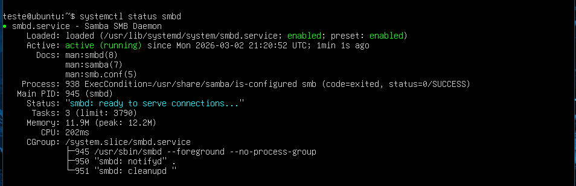
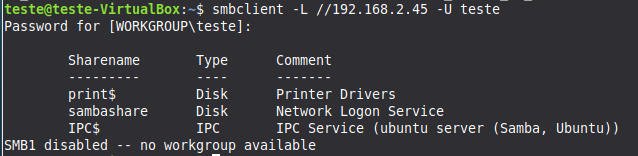
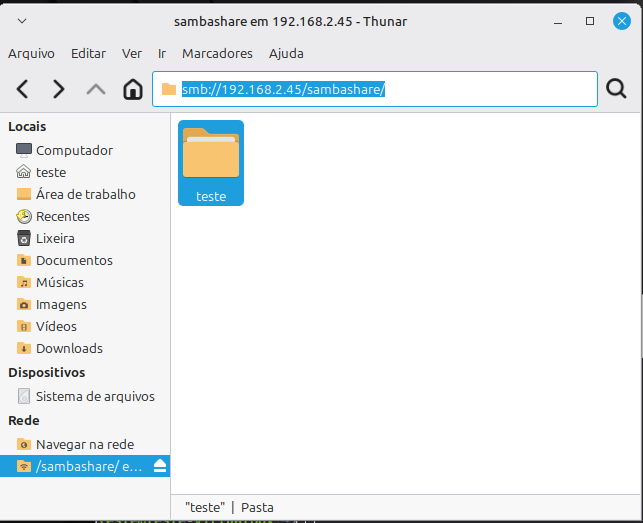

# Servidor de Arquivos com Samba

## Descrição

Implementação de um servidor de arquivos utilizando **Samba** em
ambiente Linux, permitindo compartilhamento entre máquinas Linux e
Windows dentro de uma rede local.

O projeto simula um cenário simples de ambiente corporativo, aplicando
autenticação obrigatória, controle de permissões e boas práticas básicas
de segurança.

------------------------------------------------------------------------

## Ambiente

-   Ubuntu Server 22.04 LTS\
-   Samba\
-   Rede local (LAN)\
-   IP do servidor: 192.168.0.10\
-   Diretório compartilhado: `/home/teste/sambashare`

------------------------------------------------------------------------

## Topologia

    Cliente (Linux/Windows)
            ↓
    Rede 192.168.0.0/24
            ↓
    Servidor Samba (192.168.0.10)

Acesso ao compartilhamento:

    smb://192.168.0.10/sambashare

------------------------------------------------------------------------

## Instalação

``` bash
sudo apt update
sudo apt install samba
```

Verificação do serviço:

``` bash
systemctl status smbd
```

------------------------------------------------------------------------

## Configuração do usuário

Criação do usuário no sistema:

``` bash
sudo useradd teste
sudo passwd teste
```

Adição do usuário ao Samba:

``` bash
sudo smbpasswd -a teste
```

------------------------------------------------------------------------

## Criação do diretório compartilhado

``` bash
sudo mkdir -p /home/teste/sambashare
sudo chown teste:teste /home/teste/sambashare
sudo chmod 770 /home/teste/sambashare
```

Permissões aplicadas:

-   Acesso restrito ao usuário autorizado
-   Escrita habilitada
-   Bloqueio para outros usuários do sistema

------------------------------------------------------------------------

## 🛠 Configuração do Samba

Arquivo editado:

    /etc/samba/smb.conf

Trecho adicionado:

``` ini
[sambashare]
   path = /home/teste/sambashare
   browsable = yes
   writable = yes
   guest ok = no
   valid users = teste
   force user = teste
   force group = teste
   create mask = 0660
   directory mask = 0770
```

Aplicação das alterações:

``` bash
sudo systemctl restart smbd
```

Validação da configuração:

``` bash
testparm
```

------------------------------------------------------------------------

## Medidas de Segurança

-   Acesso anônimo desativado
-   Autenticação obrigatória
-   Controle de permissões via sistema de arquivos Linux
-   Máscaras de criação restringindo permissões excessivas
-   Serviço restrito à rede local

------------------------------------------------------------------------

## Testes Realizados

-   Conexão via cliente Linux
-   Conexão via cliente Windows
-   Tentativa de acesso com usuário inválido (bloqueado)
-   Criação e exclusão de arquivos pelo usuário autorizado

Teste via terminal:

``` bash
smbclient -L //192.168.0.10 -U teste
```

------------------------------------------------------------------------
## Evidências de Funcionamento

### Status do Serviço



### Teste via smbclient



### Acesso pelo Linux



### Permissões do Diretório


------------------------------------------------------------------------

## ⚠ Problemas Encontrados

### Permissão negada ao criar arquivos

Causa: ownership incorreto do diretório\
Solução: ajuste com `chown` e `chmod`

------------------------------------------------------------------------

### Falha de autenticação

Causa: usuário criado no sistema, mas não adicionado ao Samba\
Solução: utilização do comando `smbpasswd -a teste`

------------------------------------------------------------------------

### Alterações não aplicadas

Causa: serviço não reiniciado após edição do smb.conf\
Solução: reinício com `systemctl restart smbd`

------------------------------------------------------------------------

## Melhorias Futuras

-   Implementar múltiplos grupos com permissões distintas
-   Restringir acesso por faixa de IP
-   Integrar com firewall (ufw ou nftables)
-   Implementar monitoramento do serviço
-   Integração com Active Directory

